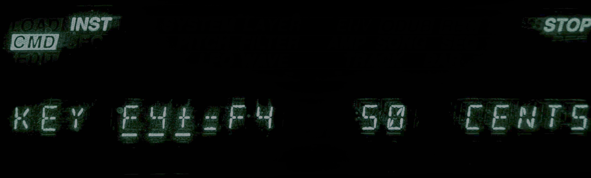

# Ensoniq Microtonal Pitch Tables and Live Set Guide

These are microtonal pitch tables for use with vintage Ensoniq samplers like the EPS-16+ and the ASR-10, and the ASR-V emulator. (Probably many Ensoniq synthesizers as well.) Ensoniq pitch tables are transposition-mapped to nearest naturals or sharps with an offset of cents (sharpening – positive numbers only). These tables focus on makam/maqam and Balkan tables because those are the ones I like.

Rows read like so:

`F4+,F4,50,359.46,F4+=F4 50 cents,arabic_bayati_a_approx`

The first column is the name of the keyboard key.  The second is the target chromatic note, the third is the offset in cents.  The remaining columns are ancillary; frequency, how it appears in the keyboard's display, and the name of the table.

The above example would look like so in the keyboard's display:

## Tonic Folders

The *note*_tonic folders are for use when your drone/home tone is *note*

## Suggested 4-Table Live Set (per tonic folder)

- `arabic_bayati_*` -> warm, vocal, introspective, neutral-second color
- `turkish_hicaz_*` -> tense, dramatic, ornamental lead lines
- `balkan_gaida_thracian_*` or related gaida table -> drone-forward folk color
- `balkan_hijaz_*` -> dance/drive with stronger altered-second pull

## Quick Performance Workflow

1. Pick the tonic folder matching your current song center.
2. Start with Bayati for stable melodic passages.
3. Switch to Hicaz for tension sections or cadential lift.
4. Use Gaida/Balkan variants for folk-heavy tunes and drone textures.

On an Ensoniq keyboard the best way to do this is to duplicate layers and set the different pitch tables for each layer.  Then set each to be active with specific combinations of the patch select buttons of your choosing.  Note that you can set a foot switch to activate a patch select and switch tables with your foot.

## 19-EDO and 31-EDO

There are **linear equal division** tables **`edo_19_linear`** and **`edo_31_linear`**: each step up the chromatic MIDI keyboard is one step of that EDO (with **A4 = 440 Hz** at MIDI 69). Their CSVs list **MIDI 0–127** (every standard note number, **C-1** through **G9+**) to enable specialized MIDI controllers to access more octaves. They are produced by `tools/generate_pitch_tables.py` alongside the other CSVs, with matching **`scl/`** and **`tun/`** exports from `scripts/csv_to_scl.py` and `scripts/csv_to_tun.py`. **`scripts/csv_to_mts.py`** writes **`mts/*.mts`** files: raw **MIDI Tuning Standard** non-real-time **bulk tuning dump** SysEx (`F0 7E … 08 01 … F7`), one message per table, using tuning program numbers **19** and **31** respectively. See the caveats below for how this interacts with the **`.scl`** layout.

## Caveats (accuracy and exports)

These tables are **practical stage tools**, not authoritative acoustic measurements of every tradition they nod to. Real-world intonation varies by region, instrument, ensemble, and performer; the underlying literature is itself interpretive. Here the goal is a **usable Ensoniq mapping**: each physical key is tied to a **12-TET chromatic anchor** plus a **non-negative cent sharpen**. That design cannot represent every theoretical or performed inflection (for example, downward “flattening” is folded into choosing a lower anchor and sharpening from there), and the coarse grid plus rounding is a further compromise.

**Numbers in the CSVs** are rounded for display and tooling: `frequency_hz` and cent offsets are not carried at arbitrary precision, so derived quantities can drift slightly from a purely mathematical scale definition.

**Scala `.scl` files** (see `scripts/csv_to_scl.py`, output under `scl/`) encode **one chromatic octave** built from the **C4–B4** keys plus **C5** as the octave closure, with **implicit 0 cents at physical C4**. They do **not** embed Ensoniq’s full keyboard layout or per-key labels. Software that imports `.scl` without a **Scala keyboard mapping (`.kbm`)** will apply its own mapping, which may not match how these tables feel on an Ensoniq.

For the **linear 19-EDO and 31-EDO** tables, those twelve chromatic keys from **C4** to **C5** are **not** twelve twelfths of a 12-TET octave: each key rises by **one step of n-EDO** (\(1200/n\) cents), so the **last listed degree is \(12 \times 1200/n\) cents above C4**, not 1200 cents. That is correct for this mapping but may confuse tools or workflows that assume a **~1200 cent** closing step or a 12-TET-sized “octave” in the `.scl` file. The **`.tun`** files still follow the CSV frequencies directly and are not special-cased in that way.

**AnaMark `.tun` files** (see `scripts/csv_to_tun.py`, output under `tun/`) set **MIDI 0–127** using the CSV **`frequency_hz`** where a row exists for that MIDI note. Notes **outside** the CSV’s keyboard span are filled with **A = 440 Hz equal temperament**, so the very low and very high ends are a convenience continuation, not sampled from the same generative logic as the table body. Where the CSV frequencies are rounded, **Exact Tuning** cent values can differ by a tiny amount from an idealized closed-form tuning. The **linear EDO** CSVs cover all **128** MIDI note numbers, so their **`.tun`** files do not use that ET fill inside **0–127**.

**MIDI Tuning Standard bulk dumps** (see `scripts/csv_to_mts.py`, output under `mts/`) are **single SysEx messages** (raw bytes, file extension **`.mts`**) in universal non-real-time form **sub-ID 08 01**, built from the same **`frequency_hz`** values as the EDO CSVs. Each dump uses device ID **7F**, a **16-byte ASCII name** (space-padded), and the standard **three-byte / 21-bit frequency word** per note. Packing and the **16383** fractional scale match the **MTS-ESP** reference client (`Client/libMTSClient.cpp` in [ODDSound/MTS-ESP](https://github.com/ODDSound/MTS-ESP)); see **`SOURCES.md`** for bibliography links. Hardware and hosts differ in how strictly they validate checksums and field padding, so if a device rejects a file, try re-saving from an editor that specializes in MTS SysEx.

## Acknowledgements / Sources

- Turkish makam pitch logic (including comma-based practice and AEU framing): Arel-Ezgi-Uzdilek theory literature and modern explanatory summaries of that system.
- Arabic maqam practical intonation references: Ali Jihad Racy and Johnny Farraj / Sami Abu Shumays style pedagogical treatments of jins/maqam intonation and performance practice.
- Comparative Middle Eastern tuning context: Habib Hassan Touma, *The Music of the Arabs*.
- Balkan modal/intonation performance context (gaida/hijaz-type color): ethnomusicology and regional practice-oriented descriptions of Bulgarian/Macedonian/Thracian traditions.
- Just-intonation baseline references used for the "just major" style table: 5-limit interval ratio practice (common tuning theory sources).
- Indonesian slendro/pelog approximation basis: standard gamelan interval-distribution descriptions, then mapped to the Ensoniq keyboard limitations.
